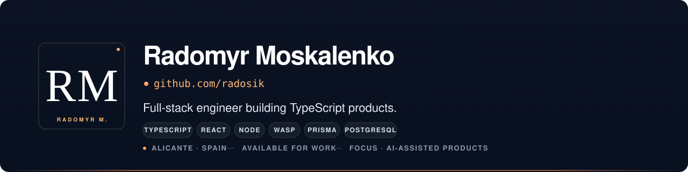

<p align="center">
  
</p>

<p align="center">
  
  
  
  
</p>

## Hi, I'm Radomyr

Full-stack engineer focused on **TypeScript products** — practical AI-assisted tooling, clean UX, and codebases someone else can pick up and ship. Based in Alicante, finishing 1DAW while building a self-hosted decision-support tool for shipment planners.

I care about: a small set of well-chosen primitives over framework soup · multi-tenant data correctness · interfaces that respect the user's time · shipping the audit trail, not just the happy path.

## Featured project

### prompt.Prompts &nbsp;<sub>_current build · private repo, opening at launch_</sub>

> **Write prompts that don't waste tokens.** A studio for authoring AI prompts, seeing exactly where tokens go, and tracking AI provider news — one tab instead of five.

**Stack** — Next.js 16 (App Router, Turbopack) · React 19 · TypeScript 5 · Tailwind v4 · Supabase (Auth + Postgres + RLS) · [`@dnd-kit`](https://dndkit.com) · Framer Motion · [`gpt-tokenizer`](https://github.com/niieani/gpt-tokenizer) (`o200k_base`)

**Four jobs the product does**

- **Compose** — drag-and-drop fragment canvas. Typed snippets (role · goal · constraint · format · example · style · edge_case) with `{{placeholder}}` slots rendered as inline editable pills.
- **Topics** — 8 curated kits (Programming · School · Motion Graphics · n8n · Marketing · Writing · Data Analysis · Roleplay) that retune the picker, fragments panel, and the analyzer's required-kinds set.
- **Analyze** _(the wedge)_ — strength-score gauge (`0.45·coverage + 0.30·specificity + 0.25·efficiency`), "How to reach 100%" checklist, per-fragment token bar, real cost estimate. Local tokenization via `gpt-tokenizer` (`o200k_base`); Anthropic & Gemini exact counts via the providers' `count_tokens` endpoints behind a SHA256 cache.
- **News** — single feed for OpenAI / Anthropic / Google DeepMind / Mistral / Meta AI / xAI / Cohere _(in progress)_.

**Recent shipments** — real per-fragment tokenization · strength-score formula · version-history slide-over with restore · `@dnd-kit` polish with DragOverlay · exact-count server routes for Anthropic + Gemini · settings modal for user-pasted API keys · focus-the-target-fragment auto-scroll.

**Design bar** — Emil Kowalski-tier motion with Linear / Vercel / Anthropic-docs restraint. Quiet greys, a single rainbow conic-gradient accent used sparingly.

Repository opens at launch. Happy to walk through the build if it's relevant to the role.

## Other work

| Project | What it is | Stack |
|---|---|---|
| [Easy-Calculator-Widget](https://github.com/radosik/Easy-Calculator-Widget) — [live demo](https://radosik.github.io/Easy-Calculator-Widget/) | Drop-in calculator widget for embedding | JavaScript |
| [cryptoApi](https://github.com/radosik/cryptoApi) | Crypto market data viewer (CRA) | React · JavaScript |
| [react-finance](https://github.com/radosik/react-finance) · [Finance-Control](https://github.com/radosik/Finance-Control) | Early experiments with personal-finance UI patterns | React · TypeScript |
| [Ballon3D](https://github.com/radosik/Ballon3D) · [dermacorp3D](https://github.com/radosik/dermacorp3D) · [Three-cube](https://github.com/radosik/Three-cube) | Three.js scenes — older work, kept for visual context | Three.js |

## Tech I work with day-to-day

<p align="left">
  &nbsp;
  &nbsp;
  &nbsp;
  &nbsp;
  &nbsp;
  &nbsp;
  &nbsp;
  &nbsp;
  &nbsp;
  &nbsp;
  &nbsp;
  &nbsp;
  
</p>

```yaml
Languages: [TypeScript, JavaScript, HTML, CSS, SQL]
Frontend:  [React, Tailwind, shadcn/ui, Radix, Three.js]
Backend:   [Node, Prisma, PostgreSQL, Wasp (TS fullstack DSL)]
Tooling:   [Playwright, i18next, Docker, Mailpit, GitHub Actions]
Interests: [AI-assisted product workflows, multi-tenant SaaS, audio]
```

## GitHub at a glance

<p align="left">
  
</p>

### Contribution graph

<!-- A snake "eats" the contribution squares; regenerated every 12h by .github/workflows/snake.yml -->
<picture>
  <source media="(prefers-color-scheme: dark)" srcset="https://raw.githubusercontent.com/radosik/radosik/output/github-contribution-grid-snake-dark.svg"/>
  <source media="(prefers-color-scheme: light)" srcset="https://raw.githubusercontent.com/radosik/radosik/output/github-contribution-grid-snake.svg"/>
  
</picture>

## Get in touch

Open to full-stack engineering roles — junior or junior-plus, EU-friendly (Alicante-based, comfortable remote or hybrid). I'm most interested in teams shipping product-shaped TypeScript with real users on the other end.

- **Email** — _to be added_
- **LinkedIn** — _to be added_
- **Portfolio** — _to be added_

For project-specific questions, opening an issue on the relevant repo is the fastest path.

---

<sub>This repository is my profile workspace — the source for the banner, the index, and the snippets I reuse in bios elsewhere.</sub>
